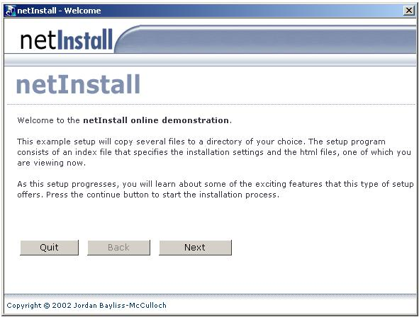



## netInstall \- An installation program that uses streamed HTML files as the setup wizard\!

### Description

This program (<50KB) is a full dynamic setup program. It loads the setup wizard over the internet from a collection of html/text files on a webserver. The advantage? A VERY small program can be downloaded very quickly to install a large program, and the wizard itself can be truly multimedia - it can use animations, javascript, flash etc. best of all, the installation can be easily updated without having to release a new installation program. Take a look - I have included a sample installation (a very basic one). NOTE: my web server has a 100mb PER MONTH bandwidth limit. f online fails, please try offline test.
 
### More Info
 

             |
---                |---
**Submitted On**   |2002-12-15 21:11:16
**By**             |[jbay101](https://github.com/Planet-Source-Code/PSCIndex/blob/master/ByAuthor/jbay101.md)
**Level**          |Intermediate
**User Rating**    |4.2 (21 globes from 5 users)
**Compatibility**  |VB 6\.0
**Category**       |[Complete Applications](https://github.com/Planet-Source-Code/PSCIndex/blob/master/ByCategory/complete-applications__1-27.md)
**World**          |[Visual Basic](https://github.com/Planet-Source-Code/PSCIndex/blob/master/ByWorld/visual-basic.md)
**Archive File**   |[netInstall15191112272002\.zip](https://github.com/Planet-Source-Code/jbay101-netinstall-an-installation-program-that-uses-streamed-html-files-as-the-setup-wiza__1-41885/archive/master.zip)

